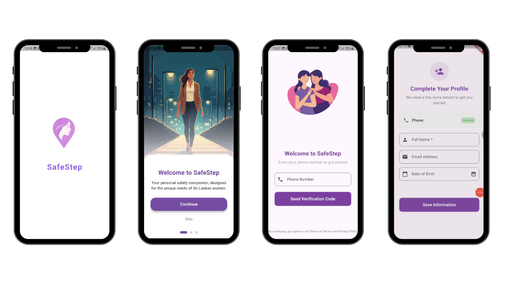
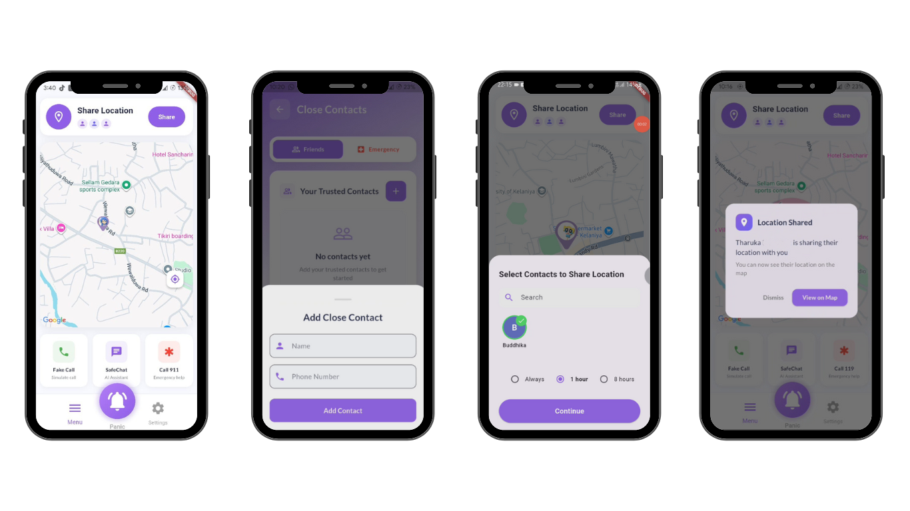
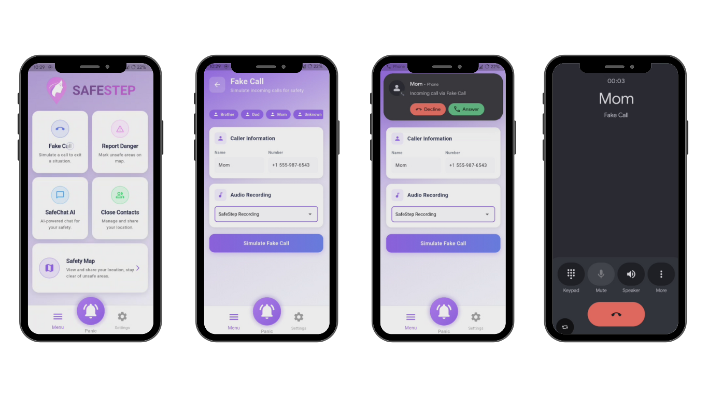
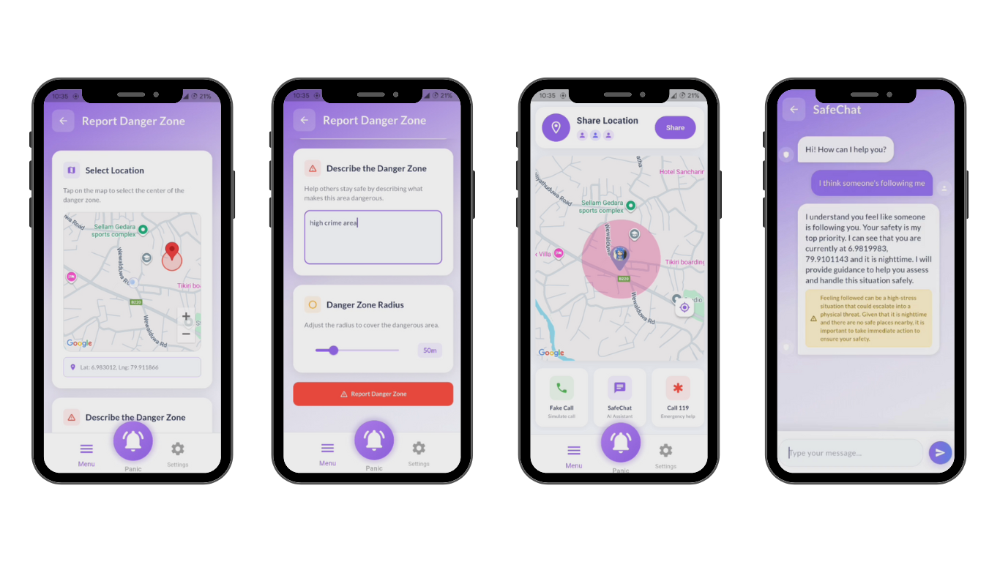
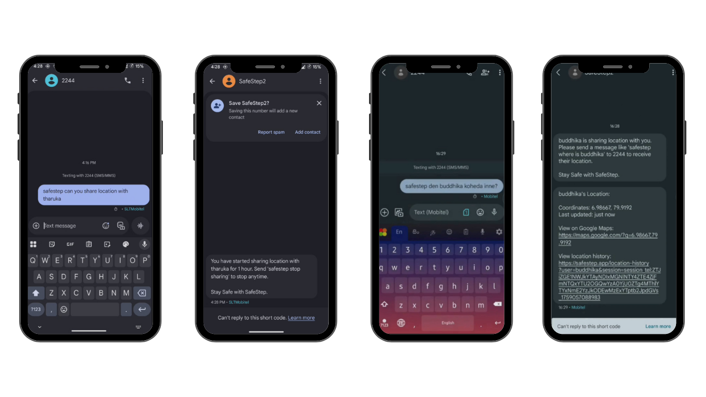
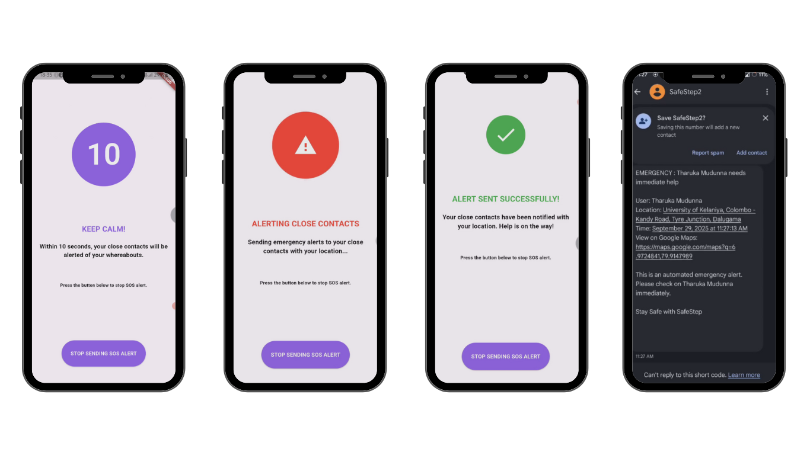

# 🛡️ SafeStep – Stay Safe, Live Free

> **Empowering Women with Real-Time Protection, Safety, and Support.**


---

## 🌟 Overview

**SafeStep** is an AI-powered **personal safety and emergency response mobile application** designed to empower women and ensure real-time protection in critical situations.  
It enables users to send instant SOS alerts, share live location, access safety routes, and connect with trusted contacts or nearby emergency services.

---

## 🚀 Key Features

- 🆘 **One-Tap SOS** – Instantly send alerts with live location to emergency contacts.  
- 📍 **Real-Time Tracking** – Share your live location with trusted guardians.  
- 🤖 **AI Safety Suggestions** – Smart route recommendations for safer travel.  
- 📞 **Emergency Hotlines** – Direct access to local police, ambulance, and help lines.  
- 🎙️ **Voice/Shake Activation** – Trigger SOS without unlocking your phone.  
- 📸 **Auto Recording Mode (Panic Mode)** – Records audio/video and uploads to cloud.  
- 🫱 **Safe Community** – Connect with verified nearby SafeStep users for help.  
- 🎭 **Fake Call** – Simulate an incoming call to escape uncomfortable situations.  
- 🔒 **Privacy First** – End-to-end encryption for all sensitive user data.

---

## 🧠 How It Works

1. **User Registration & Setup**  
   - Register phone number and add trusted contacts.  

2. **Trigger SOS**  
   - Press the SMS shortcut button or send a keyword (e.g., `HELP`).  

3. **Location Fetch & SMS Delivery**  
   - System retrieves the user’s GPS location.  
   - Generates a **Google Maps link**.  
   - Sends an SMS to trusted contacts via **MSpace API**.  

4. **Fake Call**  
   - Trigger a fake incoming call to escape uncomfortable situations.  

5. **Privacy & Security**  
   - All data shared only with authorized contacts.  
   - No unnecessary data collection.

---

## 💻 Tech Stack

| Category | Technologies |
|-----------|---------------|
| **Frontend (Mobile)** | Flutter, Dart |
| **Backend** | Firebase, Firestore, Firebase Authentication |
| **APIs & Services** | MSpace API, Google Maps API |
| **Version Control** | Git & GitHub |

---

## 📡 Links

- **SafeStep Introduction Website GitHub**: [https://github.com/ThasuniInduma/safestep](https://github.com/ThasuniInduma/safestep/edit/master/README.md)  
- **Demo Video on YouTube**: [https://www.youtube.com/embed/9OXSl0eOqj8](https://www.youtube.com/embed/9OXSl0eOqj8)  

---

## 📲 Screenshots
<table>
  <tr>
    <td>
      <figure>
        
        <figcaption>Create Profile</figcaption>
      </figure>
    </td>
    <td>
      <figure>
        
        <figcaption>Share Location</figcaption>
      </figure>
    </td>
    <td>
      <figure>
        
        <figcaption>Fake Call Simulation</figcaption>
      </figure>
    </td>
  </tr>
  <tr>
    <td>
      <figure>
        
        <figcaption>Report Danger Zone & Safe Chat</figcaption>
      </figure>
    </td>
    <td>
      <figure>
        
        <figcaption>Share Location without App</figcaption>
      </figure>
    </td>
    <td>
      <figure>
        
        <figcaption>SOS Alert</figcaption>
      </figure>
    </td>
  </tr>
</table>


---

## ⚙️ Installation & Setup

1. **Clone the Repository**
   ```bash
   git clone https://github.com/budd9442/SafeStep.git
   cd safestep
   ```

2. **Configure Secrets** ⚠️

   **Firebase Setup:**
   - Go to [Firebase Console](https://console.firebase.google.com/)
   - Download `google-services.json` → place in `android/app/`
   - Download service account JSON → save as `backend/service.json`
   - Install FlutterFire CLI: `dart pub global activate flutterfire_cli`
   - Run: `flutterfire configure` (generates `lib/firebase_options.dart`)

   **API Keys:**
   - Get [Gemini API key](https://makersuite.google.com/app/apikey) → create `.env` file:
     ```env
     GEMINI_API_KEY=your_api_key_here
     ```
   - Get [Google Maps API key](https://console.cloud.google.com/) → update `android/app/src/main/AndroidManifest.xml`:
     ```xml
     <meta-data android:name="com.google.android.geo.API_KEY" android:value="YOUR_KEY" />
     ```

   **Backend Environment:**
   - Create `backend/.env` with Firebase credentials and MSpace config
   - Use `backend/.env.example` as template

   📖 Full guide: [SECRETS_SETUP.md](SECRETS_SETUP.md)

3. **Install Dependencies**
   ```bash
   flutter pub get
   cd backend && npm install
   ```

4. **Run the App**
   ```bash
   flutter run
   ```

---

SafeStep is more than just a safety tool — it is a **lifeline for anyone, anywhere**, providing instant location sharing and emergency alerts via SMS.  
By combining **simplicity, accessibility, and privacy**, it ensures that **personal safety is never compromised**, even without a smartphone or internet connection.  

With SafeStep, we take a step forward in **empowering communities and saving lives**.  


# 💜 Team DevMates 💜
